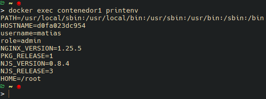
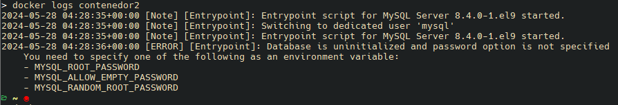
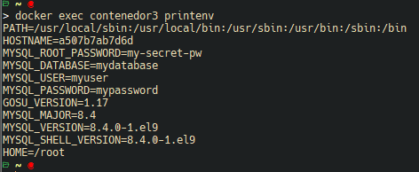
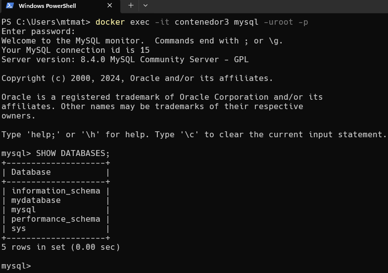

# Variables de Entorno
### ¿Qué son las variables de entorno?


Las variables de entorno son una forma de almacenar información específica del entorno del sistema operativo que puede ser utilizada por aplicaciones y procesos que se ejecutan en ese entorno. Estas variables son pares de clave-valor y se utilizan para configurar aspectos del comportamiento del sistema y de las aplicaciones sin necesidad de cambiar el código fuente.


### Ejemplos de Variables de Entorno Comunes


- PATH: Define una lista de directorios donde el sistema busca ejecutables cuando se introduce un comando.
- HOME: Indica el directorio home del usuario actual.
- USER: Contiene el nombre del usuario actual.
- TEMP o TMP: Directorio donde se almacenan archivos temporales.
- LANG o LC_ALL: Configuran el idioma y la localización del entorno.

### Para crear un contenedor con variables de entorno

```
docker run -d --name <nombre contenedor> -e <nombre variable1>=<valor1> -e <nombre variable2>=<valor2>
```

### Crear un contenedor a partir de la imagen de nginx:alpine con las siguientes variables de entorno: username y role. Para la variable de entorno rol asignar el valor admin.

```
docker run -d --name contenedor1 -e username=matias -e role=admin nginx:alpine
```

### Comprobar las variables de entorno del contenedor.


```
docker run -d --name contenedor1 -e username=matias -e role=admin nginx:alpine
```


### Crear un contenedor con mysql:8 , mapear todos los puertos
```
docker run -P -d --name contenedor2 mysql:8
```

### ¿El contenedor se está ejecutando?
```
docker ps
```

### Identificar el problema 
```
docker logs contenedor2
```


### Eliminar el contenedor creado con mysql:8 
```
docker rm contenedor2
```

### Para crear un contenedor con variables de entorno especificadas
- Portabilidad: Las aplicaciones se vuelven más portátiles y pueden ser desplegadas en diferentes entornos (desarrollo, pruebas, producción) simplemente cambiando el archivo de variables de entorno.
- Centralización: Todas las configuraciones importantes se centralizan en un solo lugar, lo que facilita la gestión y auditoría de las configuraciones.
- Consistencia: Asegura que todos los miembros del equipo de desarrollo o los entornos de despliegue utilicen las mismas configuraciones.
- Evitar Exposición en el Código: Mantener variables sensibles como contraseñas, claves API, y tokens fuera del código fuente reduce el riesgo de exposición accidental a través del control de versiones.
- Control de Acceso: Los archivos de variables de entorno pueden ser gestionados con permisos específicos, limitando quién puede ver o modificar la configuración sensible.

Previo a esto es necesario crear el archivo y colocar las variables en un archivo, **.env** se ha convertido en una convención estándar, pero también es posible usar cualquier extensión como **.txt**.
```
docker run -d --name <nombre contenedor> --env-file=<nombreArchivo>.<extensión> <nombre imagen>
```

**Considerar**
Es necesario especificar la ruta absoluta del archivo si este se encuentra en una ubicación diferente a la que estás ejecutando el comando docker run.

### Crear un contenedor con mysql:8 , mapear todos los puertos y configurar las variables de entorno mediante un archivo

```
docker run -P -d --name contenedor3 --env-file=mysqlVariables.env mysql:8
```




### ¿Qué bases de datos existen en el contenedor creado?



