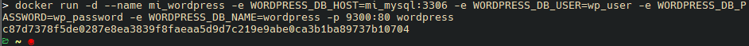
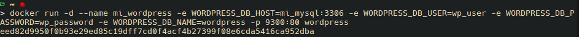

## Esquema para el ejercicio


### Crear la red
```
docker network create net-wp -d bridge
```


### Crear el contenedor mysql a partir de la imagen mysql:8, configurar las variables de entorno necesarias


### Crear el contenedor wordpress a partir de la imagen: wordpress, configurar las variables de entorno necesarias

De acuerdo con el trabajo realizado, en la el esquema de ejercicio el puerto a es **9300**


Ingresar desde el navegador al wordpress y finalizar la configuración de instalación.


Desde el panel de admin: cambiar el tema y crear una nueva publicación. Ingresar a: http://localhost:9300/ recordar que a es el puerto que usó para el mapeo con wordpress


### Eliminar el contenedor wordpress
```
docker rm -f mi_wordpress
```


### Crear nuevamente el contenedor wordpress
Ingresar a: http://localhost:9300/ recordar que a es el puerto que usó para el mapeo con wordpress



### ¿Qué ha sucedido, qué puede observar?


Se puede observar un mensaje 'Error establishing a database connection'. Lo que sucede es que al eliminar el contenedor wordpress este ha sido eliminado tambien de la red tipo bridge donde se ecnuentra el contenedor mysql. De modo que no se puede establecer conexión entre ellos.


