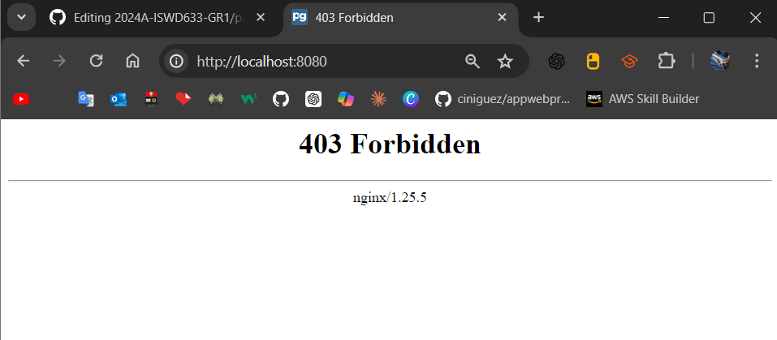
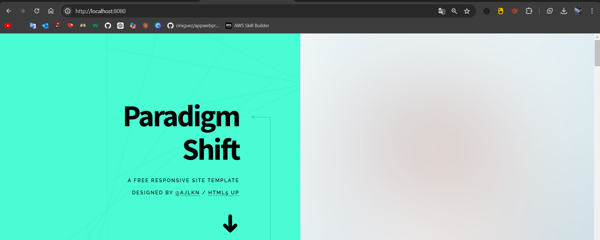

# VOLUMEN TIPO HOST
Un volumen host (o bind mount) es un tipo de volumen donde se monta un directorio o archivo específico del sistema de archivos del host en un contenedor.


```
docker run -d --name <nombre contenedor> -v <ruta carpeta host>:<ruta carpeta contenedor> <imagen> 
```

### Crear un volumen tipo host con la imagen nginx:alpine, para la ruta carpeta host: directorio en donde se encuentra la carpeta html en tu computador y para la ruta carpeta contenedor: /usr/share/nginx/html esta ruta se obtiene al revisar la se obtiene desde la documentación


```
docker run -d -v C:\Users\mtmat\OneDrive\Desktop\HTML:/usr/share/nginx/html -p 8080:80 --name mi-nginx nginx:alpine
```





### ¿Qué sucede al ingresar al servidor de nginx?


Al ingresar al servidor se observa un error 403 en nginx este significa que el servidor web no puede encontrar los archivos en la ruta especificada


### ¿Qué pasa con el archivo index.html del contenedor?


No tenia ningún archivo index.html dentro de la carpeta del contenedor, así que lo he agregado. Luego de hacerlo e ingresar al servidor de nginx se puede observar la página index.html sin ningún incoveniente.


### Ir a https://html5up.net/ y descargar un template gratuito, descomprirlo dentro de nginx/html

### ¿Qué sucede al ingresar al servidor de nginx?


Se puede observar la pagina web descargada previamente.





### Eliminar el contenedor
```
docker stop mi-nginx
docker rm mi-nginx
```

### ¿Qué sucede al crear nuevamente el mismo contenedor con volumen de tipo host a los directorios definidos anteriormente?

Al crear nuevamente el mismo contenedor con un volumen de tipo host vinculado a los directorios definidos anteriormente, el contenido del contenedor permanece intacto. Esto se debe a que no se realizaron cambios en los archivos dentro de la carpeta del host. Al recrear el contenedor, éste seguirá haciendo referencia a los archivos originales en el directorio del host.


### ¿Qué hace el comando pwd?

El comando pwd (print working directory) se utiliza en sistemas Unix y Unix-like (como Linux y macOS) para mostrar la ruta completa del directorio actual en el que te encuentras. Cuando ejecutas pwd en la terminal, el comando imprime la ruta absoluta del directorio de trabajo actual.


Si quieres incluir el comando pwd dentro de un comando de Docker, lo puedes hacer de diferentes maneras dependiendo del shell que estés utilizando.


### Volumen tipo host usando PWD y PowerShell
```
docker run -d --name <nombre contenedor> --publish published=<valorPuertoHost>,target=<valor> -v ${PWD}/<ruta relativa>:<ruta absoluta> <nombre imagen>:<tag> 
```

### Volumen tipo host usando PWD (Git Bash)

```
docker run -d --name <nombre contenedor> --publish published=<valorPuertoHost>,target=<valor> -v $(pwd -W)/html:/usr/share/nginx/html <nombre imagen>:<tag> 
```

### Volumen tipo host usando PWD (en Linux)

```
docker run -d --name <nombre contenedor> --publish published=<valorPuertoHost>,target=<valor> -v $(pwd)/html:/usr/share/nginx/html <nombre imagen>:<tag> 
```

