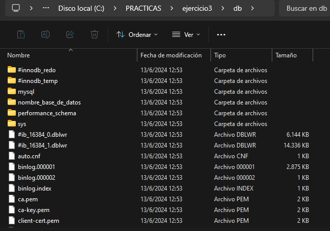
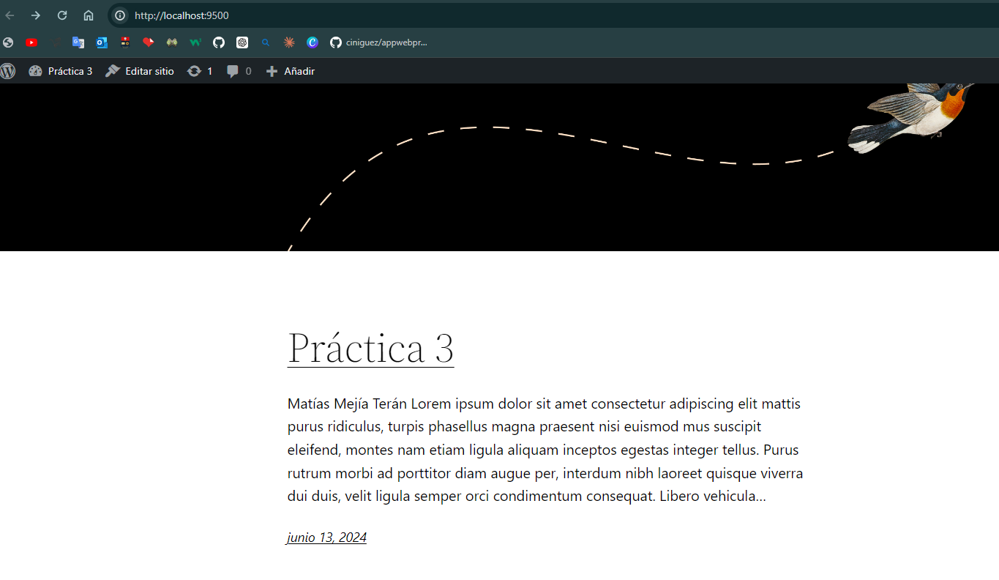

## Esquema para el ejercicio


### Crear red net-wp
```
docker network create net-wp
```

### Para que persista la información es necesario conocer en dónde mysql almacena la información.


En el esquema del ejercicio la carpeta contenedor (a) es (/var/lib/mysql)
Ruta carpeta host: ("C:\PRACTICAS\ejercicio3\db")


### ¿Qué contiene la carpeta db del host?
Por ahora está vacía, pero luego de crear el volumen, contendría toda la información sincronizada del directorio var/lib/mysql del contenedor.


### Crear un contenedor con la imagen mysql:8  en la red net-wp, configurar las variables de entorno: MYSQL_ROOT_PASSWORD, MYSQL_DATABASE, MYSQL_USER y MYSQL_PASSWORD
```
docker run -d --name mysql --env-file ${PWD}/ejercicio3/pass.env -v ${PWD}/ejercicio3/db:/var/lib/mysql --network net-wp mysql:8
```


### ¿Qué observa en la carpeta db que se encontraba inicialmente vacía?
 
 
 Ahora la carpeta db contiene los archivos y directorios que tiene el contenedor MySQL creado en su directorio /var/lib/mysql. 




### Para que persista la información es necesario conocer en dónde wordpress almacena la información.

En el esquema del ejercicio la carpeta contenedor (b) es (/var/www/html)
Ruta carpeta host: ("C:\PRACTICAS\ejercicio3\www")

### Crear un contenedor con la imagen wordpress en la red net-wp, configurar las variables de entorno WORDPRESS_DB_HOST, WORDPRESS_DB_USER, WORDPRESS_DB_PASSWORD y WORDPRESS_DB_NAME (los valores de estas variables corresponden a los del contenedor creado previamente)
```
docker run -d --name wordpress_mysql --env-file ${PWD}/ejercicio3/wordpress.env -v ${PWD}/ejercicio3/www:/var/www/html -p 1200:80 --network net-wp wordpress
```


### Personalizar la apariencia de wordpress y agregar una entrada



### Eliminar el contenedor y crearlo nuevamente, ¿qué ha sucedido?


Al eliminar el contenedor y crearlo nuevamente, las personalizaciones y las entradas agregadas anteriormente se conservan porque los datos están almacenados en el volumen montado desde el host. Esto asegura que cualquier cambio realizado en WordPress se mantenga, incluso si el contenedor es eliminado y recreado.