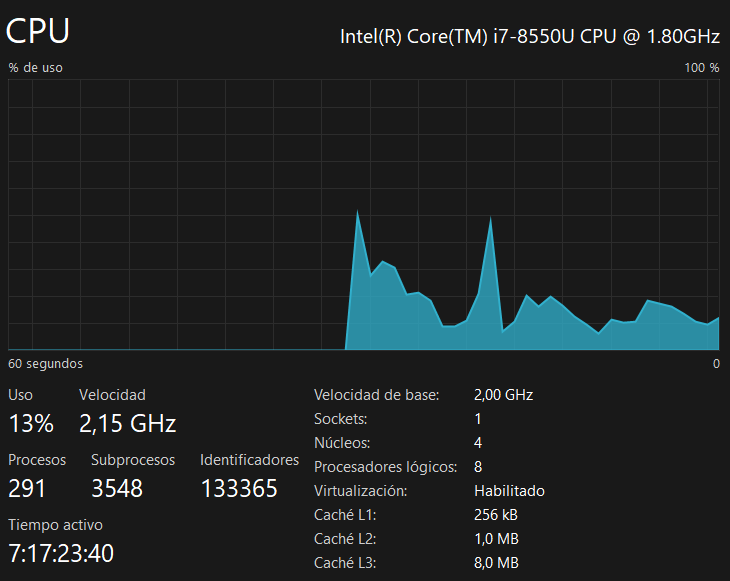
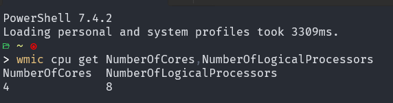

# Limitar uso de procesador
Limitar la cantidad de núcleos de CPU:
```
--cpus=<número de núcleos>
```

Asignar núcleos de CPU específicos:
```
--cpuset-cpus=<lista de núcleos>
```

**¿Como saber el numero de procesadores virtuales que tiene una máquina?**


En windows podemos dirigirnos al apartado de administrador de tareas, seguidamente a la pestaña rendimiento. Allí nos dirgimos a CPU y podemos observar el número de procesadores virtuales que tiene la máquina.





O ejecutar el siguiente comando:


```
wmic cpu get NumberOfCores,NumberOfLogicalProcessors
```



### Para crear y ejecutar los siguientes contenedores usar la imagen de nginx:alpine

Limitar el uso de CPU a 1.5 núcleos
```
docker run -d --name server-nginx --cpus="1.5" nginx:alpine

```

Restringir el contenedor para que use los núcleos de CPU 0 a 2:
```
docker run -d --name server-nginx --cpuset-cpus="0-2" nginx:alpine

```

Restringir el contenedor para que use los núcleos de CPU 1 y 3:
```
docker run -d --name server-nginx --cpuset-cpus="1,3" nginx:alpine

```
